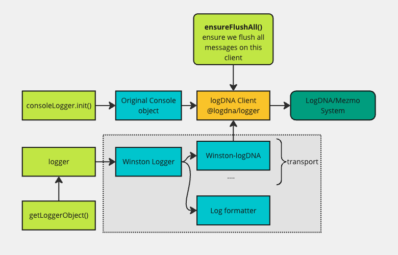
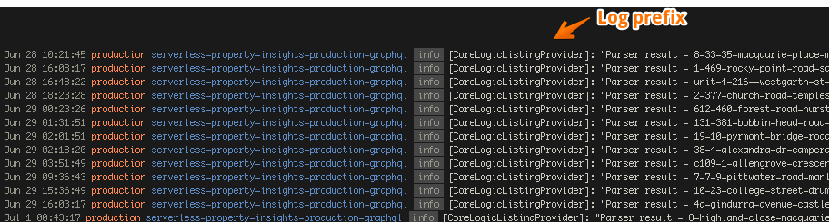

# Mezmo (Formerly LogDNA) Logger Adapter

Notes - LogDNA made a decision not to rename the library to Mezmo just yet. To avoid having two names, we decided to
keep the variable, class and etc as LogDNA for now.

---

This is our BYB logger module that is designed to support multiple two logging scenarios.

- Some repos may heavily rely on console.log() or similar to output log on the console. We can utilise this module to
  wrap around the original `console` so all logs can be sent to Mezmo as well. The service need to add
  `consoleLogger.init()` in the handler.
- A Winston logger - Winston creates a generic logger objec that allows us to perform various operations on the log e.g.
  change the colour of the log line, format message, can customise/add a custom code (using a transport mechanism) to
  send log messages to Mezmo or store in the database if we want.

This module is designed to work on a native node runtime and in a Lambda environment. For Lambda, please see the
[Flush All Messages](#Flush-All-Messages) section below.

## Console Logger vs. Winston Logger

- Dispite that `console.log()` is not a recommended approach to be used for frontend application but it's fine to use in
  the backend. Here are some limitations:
  - The native `console` log object doesn't support the `LOG_LEVEL`. For example, you may not want `console.debug()` to
    show debugging info on a production server.
  - Doesn't support log colour
  - Doesn't show datetime which is hard to make sense of
  - Doesn't support to send log to external services
- Console Logger wraps over the existing `console` object as a pathway to adopting a `logger` object.
  - Log levels
  - Send to external service
- Winston Logger solves all limitations described above

If you are using `console.log` on the existing code base and not ready to switch to Winston logger just yet, this module
can also helps you out as well.

### Versions

- **v1.x.x (first version)**
  - Originally created in 2020 but the `logdna` module is no longer maintained (https://www.npmjs.com/package/logdna).
    We need to move away from it.
- **v2.x.x**
  - Utilise the latest module actively maintained by Mezmo team (https://www.npmjs.com/package/@logdna/logger)
  - Fix a missing some log line issue occured due to the the fact that `logdna-winston` module creates a separate logdna
    client instance and it doesn't get a chance to fully flush messages before Lambda terminates. We decided to
    customise this module in this project and allow us to utilise a single instance of a LogDNA logger object so that
    `ensureFlushAll()` can flush those messages before we terminate Lambda function. This single LogDNA is shared and
    used by both console log wrapper and LogDNA transport as part of Winston log system.
  - Although it is not a major change, users of this module would like an explicably upgraded version. Just update to
    the most recent v2 version; no API modifications are necessary on the consumer side.
  - Also moved `createLoggerObject()` into this shared module so it's easier to use and prefix message before returning
    the actual logger object. e.g. `createLoggerObject(`[LOG-PREFIX]`);`
  - 
- **v2.0.3 onwards**
  - Adding generic `MetricLogger`

## 1) Use Console Logger

```
  yarn add @beforeyoubid/logger-adapter
```

### Activate it

We follow 12-factors and we can enable and send log to LogDNA by supplying LOGDNA_KEY as part of the environment
variables.

```
  LOGDNA_KEY=xxxxxxyyyyyyyzzzzzzz
```

Please note that on your local, you can set `LOGDNA_KEY=` to disable sending logs to LogDNA. Supply `LOG_LEVEL` as part
of the environment variable.

Additionally, you can keep `LOGDNA_KEY` value the same way you set for other environments but can disable sending logs
by setting `LOGDNA_ENABLED=false` in your env variables.

### For a non-lambda environment

```
    import { consoleLogger } from '@beforeyoubid/logger-adapter';
    consoleLogger.init();

    // Don't need to call consoleLogger.flushAll(), logdna object has default flush interval interval at 250ms
```

## Flush All Messages

LogDNA puts messages in the buffer and push out every 250ms. If Lambda is terminated before some of these intervals,
it's likely that some of message logs are not sent to LogDNA. Use `ensureFlushAll()` to flush messages automatically.

### Lambda: Use a handler wrapper for Serverless Express

```
  import { consoleLogger, ensureFlushAll } from '@beforeyoubid/logger-adapter';
  consoleLogger.init();

  export default ensureFlushAll(yourLambdaHandler);

```

### Lambda: Use with a Callback Handler

```
  import { consoleLogger, ensureFlushAllCallback } from '@beforeyoubid/logger-adapter';
  consoleLogger.init();

  export default ensureFlushAllCallback(yourLambdaHandlerCallback);

```

## 2) Use Winston Logger

```
  yarn add @beforeyoubid/logger-adapter
```

### Activate it

We follow 12-factors and we can enable and send log to LogDNA by supplying LOGDNA_KEY as part of the environment
variables.

```
  LOGDNA_KEY=xxxxxxyyyyyyyzzzzzzz
```

Please note that on your local, you can set `LOGDNA_KEY=` to disable sending logs to LogDNA. Supply `LOG_LEVEL` as part
of the environment variable.

### For a non-lambda environment

```
    import { logger } from '@beforeyoubid/logger-adapter';

    logger.debug('This message only show up when LOG_LEVEL is set to "debug"')
    logger.info('This message only show up when LOG_LEVEL is set to "info"')
```

### Lambda: Use a handler wrapper for Serverless Express

```
  import { logger, ensureFlushAll } from '@beforeyoubid/logger-adapter';

  // you can use logger.debug('log text in a string format');

  export default ensureFlushAll(yourLambdaHandler);

```

### Lambda: Use with a Callback Handler

```
  import { logger, ensureFlushAllCallback } from '@beforeyoubid/logger-adapter';

  // you can use logger.debug('log text in a string format');

  export default ensureFlushAllCallback(yourLambdaHandlerCallback);


```

### Prefixing your log message

In some cases, you may want to have a clearer log message by prefixing them with a predefined string e.g. name of your
module so they look like this. 

```
  import { getLoggerObject } from '@beforeyoubid/logger-adapter';

  const logger = getLoggerObject('[Your Custom Prefix]');

  logger.info('the usual log string...')
```

**Notes that** this function just wraps the original Winston logger instance your normally access from this line.
`import { logger } from '@beforeyoubid/logger-adapter';`. It only wraps and add the prefix the log line for you and
returns with debug, info, warn, error functions.

## MetricLogger

**Motivation:**

- Mezmo is one of the leading telemetry tools for logging and debugging
- We can also utilise Mezmo to collect, process and display business metrics based on log messages without extra fee on
  the existing plan
- The setup is very simple and Mezmo does this out of the box

**How does it work?**

- When a JSON string (e.g. `JSON.stringify(jsonObject)`) is sent to Mezmo, Mezmo is smart enough to parse this into a
  json object and index them automatically
- With this process, we can search for any value in the object and/or create a dashboard on any specific metric we see
  fit
- The only drawback, the data retention is usually limited to 30 days as per the data retention policy on the account

**How to use:**

- [Sample Metric](./samples/metricLogger.md)
- [Sample 1](./samples/metricLogger1.sample.ts)
- [Sample 2](./samples/metricLogger2.sample.ts)
