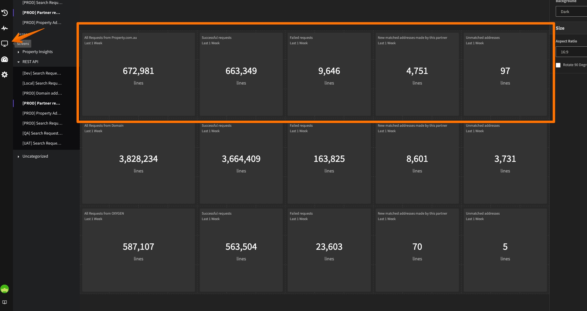

**Example Metric on Mezmo**

- On REST-API service, each time our partner sends a report pricing request to us, we produce the result to Mezmo
- This usually means success or failure so we can track the performance of the overall pricing requests.
- The current metric also support breakdown by partner id, type of error, success or failure, the acual slug if we would
  like to group them
- 
